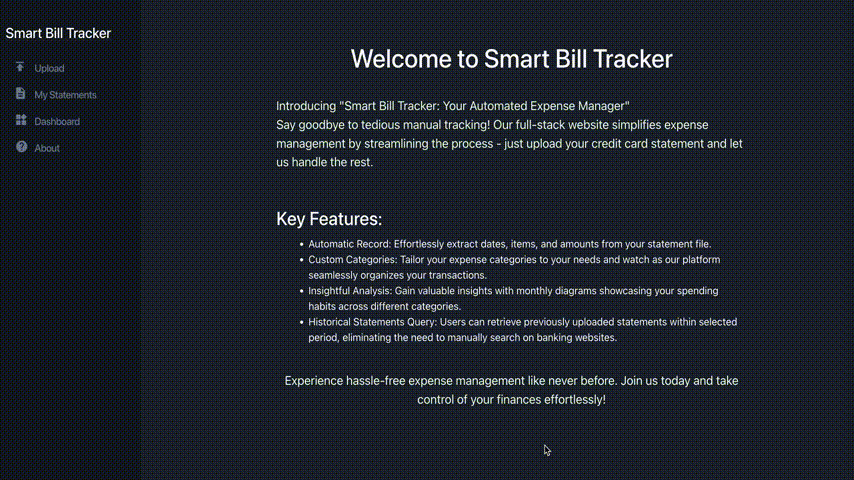

# Smart Bill Tracker

Welcome to Smart Bill Tracker - Your Automated Expense Manager!

Say goodbye to tedious manual tracking! This full-stack website simplifies expense management by streamlining the process - just upload your credit card statement and let us handle the rest.

## Features

- **Automatic Record:** Effortlessly extract dates, items, and amounts from your statement file.
- **Custom Categories:** Tailor your expense categories to your needs and watch as our platform seamlessly organizes your transactions.
- **Insightful Analysis:** Gain valuable insights with diagrams showcasing your spending habits across different categories.
- **Historical Statements Query:** Users can retrieve previously uploaded statements within selected period, eliminating the need to search on banking websites manually.

## Installation

To install Smart Bill Tracker, follow these steps:

- Clone this repository to your local machine.
- Navigate to the project directory.
- Install dependencies by running `npm install`.
- Start the development server by running `npm start`.
- Execute the backend server by running `python server.py`.

## Usage

- **Upload Statement:** Navigate to the "Upload" page and upload your credit card statement(PDF file). You can use [this statement](demo/Statement_example.pdf) as your example file. The process includes handling special cases and providing informative messages.
- **Categorize Transactions:** Once the statement is uploaded, categorize each transaction accurately.
- **View Expense Analysis:** Head to the "Dashboard" page to visualize your expenses through charts and graphs.
- **Query Historical Data:** Access your historical transaction data on the "My Statement" page by specifying the desired time range.

